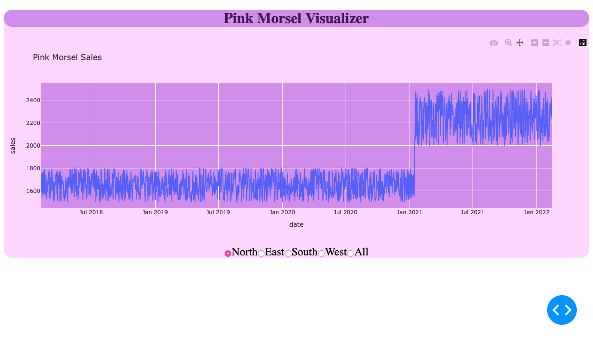

```markdown
# Project Overview

This project aims to create an interactive visualization tool using the Dash framework to analyze transaction data provided by Soul Foods. The primary goal is to answer questions regarding sales trends before and after a price increase on January 15, 2021, for Pink Morsels.

## Introduction

Data processing is crucial for transforming raw data into useful information. Soul Foods provided three CSV files containing transaction data for their morsel line. The task involves processing this data to extract relevant information and visualize it effectively.

## Data Processing

- Remove rows with products other than Pink Morsels.
- Combine "quantity" and "price" columns into a single "sales" field.
- Retain the "date" and "region" fields.

## Setup

To set up the development environment:

1. Clone this repository and navigate to the root folder.
2. Create and activate a new Python 3.9 virtual environment:
    ```bash
    python3 -m venv venv
    source venv/bin/activate
    ```
3. Install dependencies:
    ```bash
    pip install -r requirements.txt
    ```

## How to Run This App

*(These instructions are for Posix/bash. Windows users should check [here](link_to_windows_instructions).)*

1. Clone this repository and open a terminal inside the root folder.
2. Create and activate a new virtual environment (recommended) by running the following:
    ```bash
    python3 -m venv venv
    source venv/bin/activate
    ```
3. Install the requirements:
    ```bash
    pip install -r requirements.txt
    ```
4. Run the app:
    ```bash
    python app.py
    ```
5. Open a browser at [http://127.0.0.1:8050](http://127.0.0.1:8050).
6. To close the virtual environment:
    ```bash
    deactivate
    ```

## Resources

- [Dash Documentation](https://dash.plotly.com/)
- [Pandas Documentation](https://pandas.pydata.org/docs/)
- [Python Virtual Environments](https://docs.python.org/3/tutorial/venv.html)

```

## Visual display

